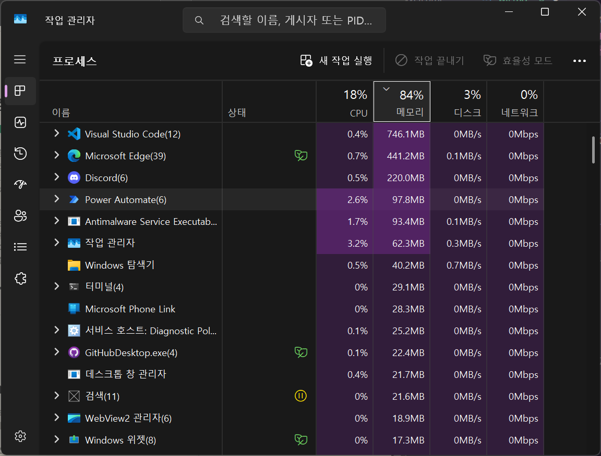

# WEEKLY I LEARNED | First Week | 개요

## 0. 컴퓨터에서 정보는 BIT와 CONTEXT이다.

**"`01000001`은 무엇을 뜻할까?"** 라고 물어보면 답을 해줄 수 없다. 비트의 나열 자체로는 아무 의미를 가지지 않기 때문이다.

`01000001`이 정수라면 65가 되고, 어떤 픽셀의 RGBA 색상의 처음 8자리 값이라면 그 픽셀의 붉은 정도, ASCII 코드라면 A라는 문자가 된다.
즉, **비트는 비트를 설명하는 맥락이 있을 때 의미를 갖는다.**

이 관계는 '변수를 이용하는 코드'와 '변수의 스코프'가 갖는 관계에도 적용된다. 코드는 스코프를 알고 있을 때 의미가 있다.

```javascript
let x = "a";
console.log(x); // 코드는 같지만 스코프에 따라 의미가 나뉨
{
  let x = 12;
  consoled.log(x); // 코드는 같지만 스코프에 따라 의미가 나뉨 22
}
```

## 1. 프로세서는 메모리를 읽으며 처리한다.

다음 프로그램을 작성한다.

```python
# hello.py
print("Hello, world!")
```

파워셸에서 다음을 실행한다.

```powershell
python hello.py
```

실행결과로 다음이 출력된다.

```
Hello, world!
```

이 과정에서,

1. `python hello.py`를 입력할 때 각 글자 -> Input Device(키보드) -> CPU 레지스터 -> **메인 메모리**
2. OS가 **메인 메모리**를 할당해서 프로세스를 만듬.
3. 하드 드라이브에서 Python 인터프리터를 **메인 메모리**로 불러옴.
4. `hello.py`의 `print()`명령이 출력할 각 글자 -> CPU 레지스터 -> Output Device

거의 모든 과정에 메모리가 관여된다!

### Bus

각 장치 사이의 연결을 담당한다.
버스의 데이터를 넘기는 단위를 word라고 하는데,
이 크기에 따라 레지스터의 크기, 주소의 개수, instruction의 크기(RISC CPU)가 영향을 받는다.
word의 크기로 32bit/64bit 컴퓨터가 분류된다.

#### 종류

- System Bus
- Memory Bus
- I/O Bus

### Cache

장치 사이의 이동을 빠르게 하기 위해서 장치들 사이에 작고 빠른 메모리를 추가한다.

- 메모리가 클수록 propagation delay로 인한 속도 저하
- 성능이 좋을수록 가격이 높음 (💸🐇SRAM > DRAM🐢)
- 메인 메모리는 용량이 커야 하기 때문에 느리지만 싼 DRAM으로 만든다.
- 빠른 CPU와 느린 메인 메모리 사이 속도 차이를 완충하는 버퍼가 필요하다.
- 그 버퍼의 역할이 캐시 메모리이고, 캐시 메모리는 비싸지만 빠른 SRAM으로 만든다.
  > Regs File ↔️ L1 cache ↔️ L2 cache ↔️ L3 cache ↔️ Main Memory ↔️ Local Secondary Storage ↔️ Remote Secondary Storage

#### How Do Cache Memories Work?

- 데이터는 메인 메모리와 캐시 사이에서 **cache line**이라는 고정 크기의 블록으로 전달된다.
- cache line이 **메인 메모리로부터 캐시에 복사**되면 **cache entry**가 생성된다.
- cache entry는 복사된 데이터와 그 **메모리 주소 또는 tag**로 구성된다.
- CPU가 cache로부터 원하는 데이터를 찾는다면 **cache hit**이 발생했다고 하고, 찾지 못하면 **cache miss**가 발생했다고 한다.
  - cache hit 발생 시, CPU는 그 cache line에 바로 read/write가 가능하다.
  - cache miss 발생 시, 캐시는 새 cache entry를 만들고 메인 메모리로부터 데이터를 복사해온다.
- cache entry를 만들 때 공간이 부족하다면 이미 존재하는 cache entry를 삭제해야 하는데, **replacement policy**라는 기준에 따라 어떠한 entry가 우선적으로 삭제된다.
- 캐시에 쓰인 데이터는 언젠가는 메인 메모리에도 쓰여야하는데, **write policy**라는 기준에 따라 쓰일 타이밍이 결정된다.

#### 왜 SRAM이 DRAM보다 빠르고 비쌀까?

<table>
    <tr>
        <th>특징</th>
        <th>SRAM</th>
        <th>DRAM</th>
    </tr>
    <tr>
        <td>구성</td>
        <td>트랜지스터(MOSFET) 6개 => 플립플롭</td>
        <td>트랜지스터(MOSFET) 1개 + 커패시터 1개</td>
    </tr>
    <tr>
        <td>데이터 유지</td>
        <td>전원이 계속 가해진다면 유지됨</td>
        <td>커패시터가 전압을 잃으므로 refresh가 필요함 </td>
    </tr>
    <tr>
        <td>속도</td>
        <td>refresh가 없음; 빠름</td>
        <td>주기적 refresh; 느림</td>
    </tr>
    <tr>
        <td>집적도</td>
        <td>구성이 복잡함; 낮음</td>
        <td>구성이 단순함; 높음</td>
    </tr>
    <tr>
        <td>가격</td>
        <td>비쌈</td>
        <td>저렴</td>
    </tr>
</table>

## 2. OS가 하드웨어를 관리한다.

### File

바이트를 읽고 쓸 수 있는 것

- Read -> Input
- Write -> Output

I/O Devices는 File로 생각할 수 있다.

### Virtual Memory

프로그램이 메모리에 접근할 때 그게 실제의 메모리 위치를 나타내는 것은 아닌데, 가상 메모리 주소를 이용하기 때문이다.
가상 메모리는 OS가 관리한다. 가상 메모리와 실제 메모리의 주소는 1:1 매핑할 수 있다.

### Process

프로그램이 실행되고 있는 상태.
운영체제가 프로세스에게 CPU나 메모리(가상 메모리!) 등의 하드웨어 자원을 할당해준다.



### Context Switching

각 CPU 코어 하나는 한 프로세스만 실행할 수 있는데(? 공부 필요) 프로세스가 여럿 실행될 수 있도록, context switching을 한다.
현재 프로세스의 상태를 context로 저장하고, 다른 프로세스의 context를 불러오는 식으로 프로세스 사이를 전환한다.
잦은 switching은 성능 하락의 원인이 되기도 한다.

## 3. 추상화

어떠한 문제를 일반화 해서, 다양한 문제에 적용할 수 있도록 해준다.

- 각각의 I/O devices -> Files
- 다양한 객체 -> Class
- 다양한 타입의 클래스 -> Template
- API
